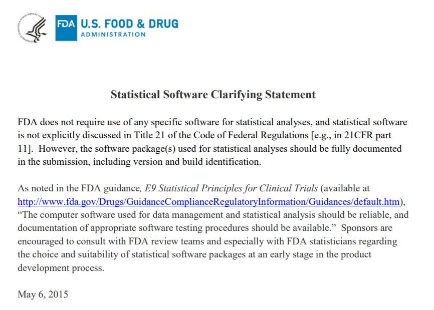
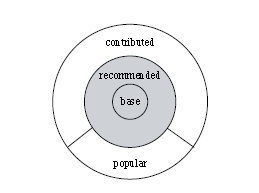
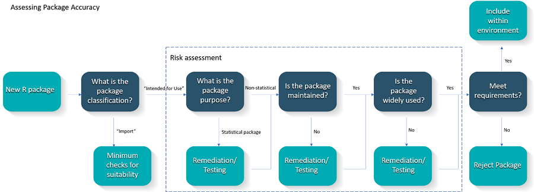

```{r startup, include = FALSE, message = FALSE, warning = FALSE, cache=TRUE}

library(ggplot2)
library(kableExtra)
library(dplyr)
library(countdown)

thm <- theme_bw() +
  theme(
    panel.background = element_rect(fill = "transparent", colour = NA),
    plot.background = element_rect(fill = "transparent", colour = NA),
    legend.position = "top",
    legend.background = element_rect(fill = "transparent", colour = NA),
    legend.key = element_rect(fill = "transparent", colour = NA)
  )
theme_set(thm)

library(knitr)
options(width = 110)

opts_chunk$set(
  fig.align = 'center',
  dev = 'svg',
  dev.args = list(bg = "transparent"),
  fig.path = "images/")
```

layout: false
class: title-slide, middle, center

.pull-farleft[

.font180[Implementing A Risk-based Approach<br>to R Validation]

R/Pharma, 2020 <br>

<div class="row">
<div class="column">
  
  <div class="profile-name">Andy Nicholls</div>
</div>


]


<!---------------------------------------------------------------------------->

---
layout: false
class: development, middle, center
# WARNING 1

## If you attended last week's workshop, don't expect anything new!


---
layout: false
class: development, middle, center
# WARNING 2

## Our workshop was 3 hours, I have 20 minutes...

---
layout: false
class: development, middle, center
# WARNING 2

## Our workshop was 3 hours, I have 19 minutes...


---
# Outline

- The R Validation Hub

- White Paper: [A Risk-based Approach for Assessing R package Accuracy within a Validated Infrastructure](https://www.pharmar.org/white-paper/)

- Implementation

- The Future


---
# Mission


> The R Validation Hub is a cross-industry initiative whose mission is to enable the use of R by the Bio-Pharmaceutical Industry in a regulatory setting, where the output may be used in submissions to regulatory agencies. 


---
# Who are we?

- Formed in 2018 by members of PSI’s AIMS SIG
- Now an [R Consortium Working Group](https://www.r-consortium.org/projects/isc-working-groups)
- Executive Committee
    - **Andy Nicholls (GSK)**
    - Marly Gotti (Biogen)
    - Lyn Taylor (Phastar)
    - Joe Rickert (RStudio / R Consortium)
    - Juliane Manitz (Merck KGaA / EMD Serono)
    - Yilong Zhang (MSD)
    - Doug Kelkhoff (Genentech)
    - Keaven Anderson (MSD)
* ~100 members from multiple organisations across the pharmaceutical sector

 
 


<!---------------------------------------------------------------------------->


---
# Regulations

FDA: “…statistical software is **not explicitly discussed** in [21 CFR Part 11]”

ICH: “… **should be reliable**, and documentation of **appropriate software testing procedures** should be available”

<a href = "https://www.fda.gov/downloads/ForIndustry/DataStandards/StudyDataStandards/UCM587506.pdf"></a>


---
# Validation / Qualification / Verification

## The Validation Misnomer

<blockquote>
"The term <b>qualification</b> is used in this notice to describe <b>verification</b> of system functionality. The term <b>validation</b> is used to describe the process of establishing and documenting that the specified requirements of a computerised system can be consistently fulfilled from design until decommissioning of the system or transition to a new system (ICH E6(R2), section 1.65), i.e. it operates to defined specifications and defined procedures (SOPs) by a trained user."
.right[-- <cite>[Notice to sponsors on validation and qualification of computerised systems used in clinical trials, EMA, 07-Apr-2020](https://www.ema.europa.eu/en/documents/regulatory-procedural-guideline/notice-sponsors-validation-qualification-computerised-systems-used-clinical-trials_en.pdf)</cite>]
</blockquote>


<!---------------------------------------------------------------------------->
---
layout: false
class: inverse, middle, center

# White Paper: A Risk-based Approach for Assessing R package Accuracy within a Validated Infrastructure

.white[
**Andy Nicholls**, Statistics Director, Head of Statistical Data Sciences, GSK

**Paulo R. Bargo**, Director Scientific Computing, Statistics & Decision Sciences, Janssen R&D

**John Sims**, Director, Analytical Systems Architect & Data Science - Pfizer Vaccine Research

]

---
# Why Risk-based?

## FDA

<blockquote>
"We recommend that you base your approach on a justified and <b>documented risk assessment</b> and a determination of the potential of the system to affect product quality and safety, and record integrity"
.right[-- <cite>[Guidance for Industry Part 11, Electronic Records; Electronic Signatures — Scope and Application](https://www.fda.gov/media/75414/download)</cite>]
</blockquote>

## EMA

<blockquote>
"The sponsor may rely on qualification documentation provided by the vendor, if the qualification activities performed by the vendor have been assessed as adequate. However, the sponsor may also have to perform additional qualification (and validation) activities based on a <b>documented risk assessment.</b>"
.right[-- <cite>[Notice to sponsors on validation and qualification of computerised systems used in clinical trials, EMA, 07-Apr-2020](https://www.ema.europa.eu/en/documents/regulatory-procedural-guideline/notice-sponsors-validation-qualification-computerised-systems-used-clinical-trials_en.pdf)</cite>]
</blockquote>

- Note: The above documents describe computerized systems and neither addresses address programming languages directly


---
# Validation, R and R Packages

The FDA provide a clear definition of validation in the [Glossary of Computer System Software Development Terminology](https://www.fda.gov/inspections-compliance-enforcement-and-criminal-investigations/inspection-guides/glossary-computer-system-software-development-terminology-895). 

This can be broken down into three core components:

1.	Accuracy
2.	Reproducibility
3.	Traceability 

**The focus of the white paper is accuracy.**


---
background-image: url("images/German-et-al.png")
background-size: 25%
background-position: 90% 16%
# What do we mean by 'R'?

- **Core R (Base+Recommended)** - Low risk
    - See [R: Regulatory Compliance and Validation Issues...](https://www.r-project.org/doc/R-FDA.pdf). 
    
    
- **Contributed** - Variable risk  
    - Many different authors
    - Varying SDLCs
    - Varying levels of popularity
    - Potentially lots of unknowns

<!--  -->


We propose a risk-based approach to establish accuracy/validity for contributed packages

.footnote[
*Source: German, D.M. & Adams, Bram & Hassan, Ahmed E.. (2013). The Evolution of the R Software Ecosystem. Proceedings of the Euromicro Conference on Software Maintenance and Reengineering, CSMR. 243-252. 10.1109/CSMR.2013.33.*
]
---
# Classifying R Packages within an Installation

- Within an installation, two classifications of R packages are proposed:

1. **Intended for Use**. These will be loaded directly by a user during an R session.
2. **Imports**. These packages are required to be installed in order to use the Intended for Use packages. They are comparable to a system dependency, or the ‘back-end’ code supporting a user interface.

- A risk-based approach to validation should focus on the way that components of the system are **intended to be used**.


---
#	An R Package Risk Assessment Framework

We propose to assess the risk of contributed R packages based on four criteria:

-	Purpose

-	Maintenance Good Practice (Software Development Life Cycle, SDLC)

-	Community Usage

-	Testing (Also part of an SDLC)

<!-- --- -->
<!-- # Pupose -->

<!-- - What will the package used for? -->


<!-- - Is it... -->


<!-- 1. Statistical? -->
<!-- 2. Non-statistical? -->


<!-- - Hence, how difficult is it for an end user to identify errors? -->


<!-- > "Tests should be written for all statistical modelling functions within an Intended for Use Statistical Package, regardless of the risk assessment." -->


<!-- - To be challenged later... -->


<!-- --- -->
<!-- # Maintenance / Testing / Community Usage -->

<!-- - Development and **maintenance** best practice are essential for any software -->
<!--     - How are bugs managed? -->
<!--     - What is the documentation like? -->
<!--     - Is the source code on GitHub? -->
<!-- - **Testing** is a crucial part of an SDLC and another specific maintenance best practice metric -->

<!-- - Increased exposure to users (**community usage**) helps to reduce risk -->

<!-- - More on these coming up... -->

---
# Proposed Workflow
 



<!---------------------------------------------------------------------------->
---
layout: false
class: inverse, middle, center
# Implementation


---

# The **riskmetric** package

- [pharmar.github.io/riskmetric/](https://pharmar.github.io/riskmetric/)


- Measures the risk of using an R package. 


- Calculated based on a number of metrics meant to evaluate development best practices, code documentation, community engagement, and development sustainability. 


- This risk does *not* represent
    - the risk of damaging the sytem in which the package is installed, or
    - the risk that the internal (statistical) functions are correct.


- Example:
  - low risk package: `ggplot2` (risk = 0.21)
  - High risk package: `tidymodels/stacks` (risk = 0.9). Does this mean we can't use it?

---

# Example using **riskmetric**

```{r, message = FALSE, warning = FALSE, cache = TRUE}
# devtools::install_github("pharmar/riskmetric")

library(riskmetric)

metrics <- pkg_ref(c("ggplot2", "stacks")) %>%
  as_tibble() %>%
  pkg_assess() %>%
  pkg_score()

metrics
```

<!-- TODO -->
<!-- Can you provide a version number to riskmetric? -->
<!-- Describe each function above -->

---

# Example using **riskmetric**

```
# devtools::install_github("pharmar/riskmetric")

library(riskmetric)

metrics <- pkg_ref(c("ggplot2", "stacks")) %>%
  as_tibble() %>%
  pkg_assess() %>%
  pkg_score()

metrics
 
```

<br>

 ```{r, echo = FALSE, message = FALSE, warning = FALSE, cache = TRUE}
 
 metrics %>%
 mutate(risk = pkg_score) %>%
 select(package, version, risk, downloads_1yr, bugs_status, bugs_status, has_maintainer, news_current, has_vignettes, export_help) %>%
 mutate("..." = "...") %>%
 kbl(., booktabs = T) %>%
 kable_styling(c("striped", "hover"), font_size = 15)
 
 ```

---

# The Risk Assessment Shiny Application

- Front end visualisations for `riskmetric`

- User feedback

- A database to store collected metrics / comments

- Reporting capabilities


---
background-image: url("images/risk_assess.png")
background-size: 98% 
background-position: 50% 50%
# The Risk Assessment App


---
# Testing

- Focus area

- Current discussions
    - May be able to make use of author tests in some circumstances
    - Testing for stats packages may not *always* be required
    - Testing to feed back into risk assessment

- Aim to write white paper for release 1H2021

- Test framework to be developed based on testthat

---
layout: false
class: inverse, middle, center
# The Future


---
background-image: url("images/roadmap.jpg")
background-position: 90% 16%
# Our Roadmap

## Process and Communication
.grey[
- Publish website
- Agree high level process
- White paper for overall approach
]
- White paper on testing
- [TBC] stats modelling handbook

## Qualification Tools
.grey[
- Key risks added to riskmetric 
- Release Risk Assessment app v1
]
- CRAN release of riskmetric
- Modularisation of app for co-development with riskmetric
- Create test framework
- Release first batch of tests
    


---
# Join us!

- Keep up to date at https://www.pharmar.org/
    - Blog posts
    - Presentations
    - White paper
    
    
- Tools available on [GitHub](https://github.com/pharmaR)
    - The riskmetric R Package
    - Risk Assessment App 
    

- To contribute, send a message to [psi.aims.r.validation@gmail.com](mailto:psi.aims.r.validation@gmail.com)

    
- Else, join the [mailing list](https://lists.r-consortium.org/g/RConsortium-Validation-Hub) today!

---
# Acknowledgements

- Marly Gotti (Biogen) for this week's workshop and this slide template
    - Our TAs from the workshop


- The R Validation Hub (PSI, EFR Consortium)


Thanks to all those involved in pulling together the R/Pharma conference!


---
# Further Reading

The following have played an important role in the formation of the white paper and this workshop


- **ICH**
    - [E9](https://www.ema.europa.eu/en/ich-e9-statistical-principles-clinical-trials#current-version-section)


- **FDA**
    - [FDA Statistical Software Clarifying Statement](https://www.fda.gov/downloads/ForIndustry/DataStandards/StudyDataStandards/UCM587506.pdf)
    - [21 CFR Part 11](https://www.accessdata.fda.gov/scripts/cdrh/cfdocs/cfcfr/CFRSearch.cfm?CFRPart=11&showFR=1)
    - [Guidance for Industry Part 11, Electronic Records; Electronic Signatures — Scope and Application](https://www.fda.gov/media/75414/download)
    - [Glossary of Computer System Software Development Terminology](https://www.fda.gov/inspections-compliance-enforcement-and-criminal-investigations/inspection-guides/glossary-computer-system-software-development-terminology-895)
    - [General Principles of Software Validation; Final Guidance for Industry and FDA Staff](https://www.fda.gov/media/73141/download)


- **EMA**
    - [Notice to sponsors on validation and qualification of computerised systems used in clinical trials](https://www.ema.europa.eu/en/documents/regulatory-procedural-guideline/notice-sponsors-validation-qualification-computerised-systems-used-clinical-trials_en.pdf)
    - [Q&A: Good clinical practice (GCP)](https://www.ema.europa.eu/en/human-regulatory/research-development/compliance/good-clinical-practice/qa-good-clinical-practice-gcp)


